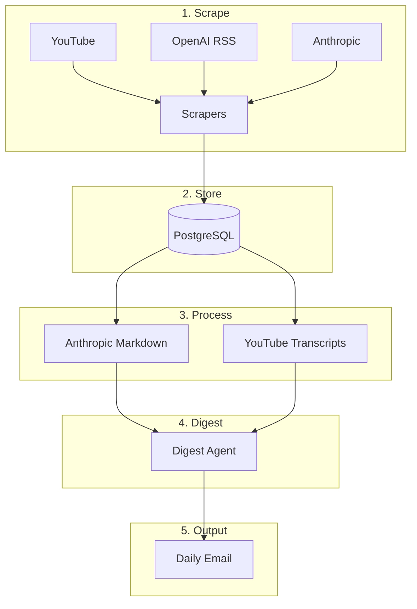

# AI News Aggregator

**One pipeline to scrape, summarize, and deliver the day's AI news—from OpenAI, Anthropic, and YouTube—straight to your inbox.**

[](LICENSE) [](https://www.python.org/downloads/) [](pyproject.toml)

---

## Project Overview

**AI News Aggregator** is an automated pipeline that solves a common problem: keeping up with AI news across multiple sources (blogs, RSS feeds, and video) is time-consuming and scattered. This project aggregates recent content from **OpenAI**, **Anthropic**, and **YouTube** channels, processes and summarizes it using AI, and sends a single **daily email digest** so you get one curated update instead of hunting across sites.

It is designed to run on a schedule (e.g., cron or a task runner) and requires minimal configuration: API keys, database, and email credentials.

---

## Key Features

- **Multi-source scraping** — Pulls articles from OpenAI blog (RSS), Anthropic blog, and YouTube channel videos (with transcripts) within a configurable time window (default: last 24 hours).
- **Persistent storage** — Saves all items in **PostgreSQL** (videos, articles, full-text/markdown where available) for deduplication and replay.
- **Content processing** — Converts Anthropic markdown and fetches/processes YouTube transcripts for summarization.
- **AI-powered digests** — Generates short, consistent summaries (title + 2–3 sentence summary) per item using an **OpenAI**-based digest agent.
- **Daily email delivery** — Sends one digest email with the top N articles to your configured address (e.g., Gmail with app password).
- **Configurable pipeline** — Optional CLI arguments for lookback hours and number of articles in the digest (`hours`, `top_n`).

---

## Tech Stack

| Category      | Technologies |
|---------------|-------------|
| **Language**  | Python 3.12+ |
| **Database**  | PostgreSQL, SQLAlchemy |
| **APIs & Data** | OpenAI API, feedparser, youtube-transcript-api, requests |
| **Processing** | BeautifulSoup, Docling, Markdown, Markdownify, Pydantic |
| **Infrastructure** | Docker (PostgreSQL), python-dotenv |

---

## Getting Started

### Prerequisites

- **Python 3.12** or higher
- **PostgreSQL** (local or in Docker)
- **OpenAI API key**
- **Email credentials** for sending the digest (e.g., Gmail address and app password)

### Installation

1. **Clone the repository**

   ```bash
   git clone https://github.com/mo7amedatef/AI_News_Aggregator.git
   cd AI_News_Aggregator
   ```

2. **Create a virtual environment and install dependencies**

   ```bash
   python -m venv .venv
   source .venv/bin/activate   # On Windows: .venv\Scripts\activate
   pip install -r requirements.txt
   ```

   Or with **uv**:

   ```bash
   uv sync
   ```

3. **Start PostgreSQL** (if using Docker)

   ```bash
   docker compose -f docker/docker-compose.yml up -d
   ```

4. **Create database tables**

   ```bash
   python -m app.database.create_tables
   ```

### Configuration

Copy the example environment file and set your secrets and database settings:

```bash
cp app/example.env .env
```

Edit **`.env`** (in the project root or as loaded by the app):

| Variable | Description |
|----------|-------------|
| `OPENAI_API_KEY` | Your OpenAI API key (required for digest generation). |
| `MY_EMAIL` | Email address that receives the daily digest. |
| `APP_PASSWORD` | App password for the sender email (e.g., Gmail app password). |
| `POSTGRES_USER` | PostgreSQL user (default: `postgres`). |
| `POSTGRES_PASSWORD` | PostgreSQL password. |
| `POSTGRES_DB` | Database name (default: `AI_News_Aggregator`). |
| `POSTGRES_HOST` | Database host (default: `localhost`). |
| `POSTGRES_PORT` | Database port (default: `5432`). |

**Note:** Remove any spaces around `=` in `.env` (e.g. use `OPENAI_API_KEY=sk-...` not `OPENAI_API_KEY= "..."`).

### Usage Examples

**Run the full pipeline** (scrape → process → digests → send email):

```bash
python main.py
```

With optional arguments (lookback hours and number of articles in the digest):

```bash
python main.py 24 10
# hours=24, top_n=10 (defaults)
```

**Run only the scrapers** (no processing, digest, or email):

```bash
python -m app.runner
```

**Run the pipeline as a module** (same behavior as `main.py`):

```bash
python -m app.daily_runner
```

---

## Architecture

The system follows a **linear pipeline**.

### Pipeline flowchart



1. **Scrape** — YouTube, OpenAI RSS, and Anthropic scrapers fetch recent content and store it in PostgreSQL.
2. **Process** — Anthropic markdown and YouTube transcripts are processed for downstream summarization.
3. **Digest** — An AI agent (OpenAI) generates a short title and summary for each item.
4. **Email** — A single digest email is built and sent with the top N items.

Data flows one way: **Scrapers → Database → Processing services → Digest agent → Email agent**. No separate orchestration framework is used; the pipeline is implemented in `app/daily_runner.py`.

---

## Project Structure

```
AI_News_Aggregator/
├── main.py                 # CLI entry point (full pipeline)
├── app/
│   ├── daily_runner.py     # Pipeline orchestration (scrape → process → digest → email)
│   ├── runner.py           # Scrapers only
│   ├── config.py           # e.g. YouTube channel IDs
│   ├── agent/              # Digest, curator, email agents
│   ├── scrapers/           # YouTube, OpenAI, Anthropic
│   ├── services/           # Processing and email sending
│   ├── database/           # Models, connection, repository, create_tables
│   ├── profiles/           # User profile support
│   └── example.env         # Example environment variables
├── docker/
│   └── docker-compose.yml  # PostgreSQL service
├── requirements.txt
└── pyproject.toml
```

---

## Contributing

Contributions are welcome. Please open an issue or submit a pull request with a clear description of the change. Ensure existing behavior and tests (if added) remain intact.

---

## License

This project is licensed under the **Apache License 2.0**. See [LICENSE](LICENSE) for details.
